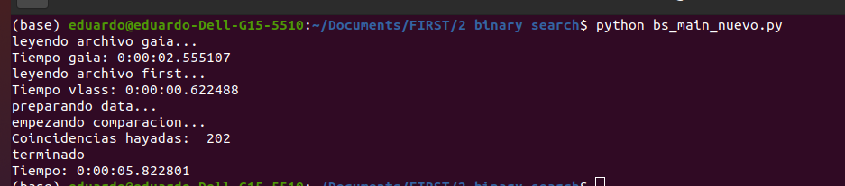

# Crossmatch Algorithm for Star and Radio Source Catalogs

This project implements an efficient algorithm to crossmatch star catalog (Gaia DR3) with radio source catalog (FIRST). The goal is to identify potential radio-emitting stars by matching these two catalogs based on angular separation.

## Features
- **Efficient search algorithm** for matching stars with radio sources.
- **Parallel processing** for faster computation.
- **Angular separation calculation** using Vincenty's formula.

## Results
The algorithm processed 946,431 radio sources and 1,026,436 stars from Gaia DR3 in approximately 6 seconds using 6 processors, demonstrating high efficiency.

## Documentation
For more details, you can read the full thesis document [here](https://drive.google.com/file/d/1-OngqpRTozFUxsD3A8Z5mg3TsVMJS712/view?usp=sharing).
